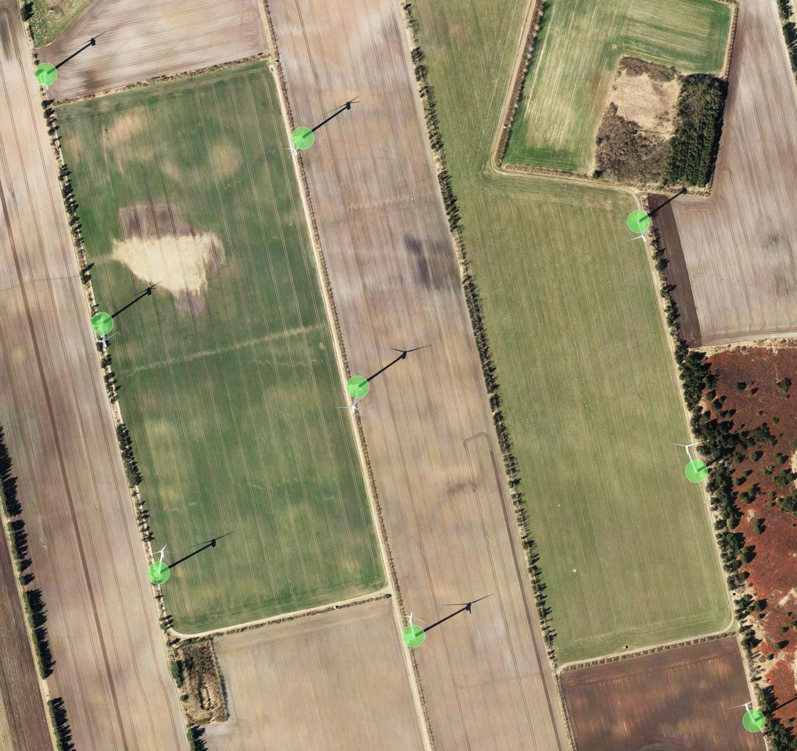

Windpower in Denmark
===========

Denmark is one of the [leading countries in windpower](http://en.wikipedia.org/wiki/Wind_power_by_country) - especially when compared to the size of the country. There's currently more than 5000 windmills
in our small, flat and windy country - and on the countryside a 360 degree look at the horizon
easily reveals 10-20, sometimes even 30 or 40 windmills.

## Data
The source of the data used in this experiment is made publicly available by the Danish Government (updated monthly):
http://www.ens.dk/da-dk/info/talogkort/statistik_og_noegletal/oversigt_over_energisektoren/stamdataregister_vindmoeller/Sider/forside.aspx

## Example map
The precision of the point data is amazing - just take a look at this map:

[View map](https://a.tiles.mapbox.com/v4/martinnormark.hdkd96nl/page.html?access_token=pk.eyJ1IjoibWFydGlubm9ybWFyayIsImEiOiJWb2x0aFkwIn0.ue2SbNWU8Caf_BRDlWjMlQ#7/55.878/9.646)